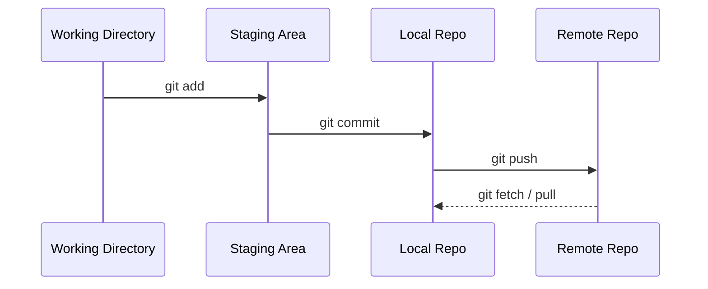
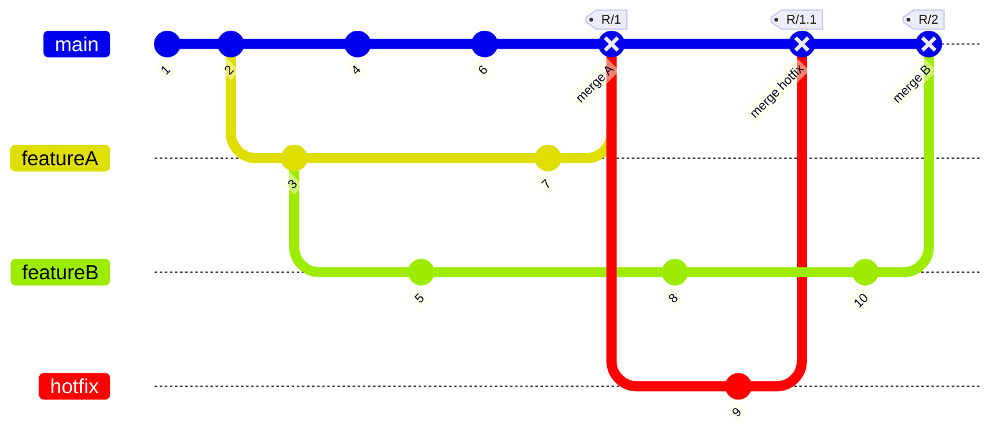

# Git Beyond the Basics <mdi-Git />


<div class="abs-br m-6 flex gap-2">
  Majed Al-Chatti
</div>


<!--
The last comment block of each slide will be treated as slide notes. It will be visible and editable in Presenter Mode along with the slide. [Read more in the docs](https://sli.dev/guide/syntax.html#notes)
-->

---
hideInToc: true
---


# Majed Al-Chatti

<br/>

<p style="width:75%;margin-top:-1em">
Solution Architect for Web & Mobile, experienced in Web Security, DevOps, and Digital Marketing. Branching into VR and Machine Learning.
</p>

<br/>

- 👔 **Web Architect** at American University of Sharjah.
- ⌛ **15+ years** in software development.
- 🧑‍💻 **Tech** .Net, Node.js, Drupal, Docker, CI/CD, Linux, Windows, SQL, and more.
- <mdi-Git /> **GitHub Enterprise** & **Azure DevOps** team and org manager.

<br>
<br>

[<mdi-github /> alchatti](https://github.com/alchatti/) | [<mdi-linkedin /> alchatti](https://www.linkedin.com/in/alchatti/) | [<mdi-twitter />  alchatti](https://twitter.com/alchatti) | [<mdi-web /> alchatti.com](https://alchatti.com)


<a style="width:150px;position:fixed; bottom:2em; right:3.5em;border:none" href="https://www.alchatti.com" target="_blank" title="alchatti.com">
  
</a>

<!--
You can have `style` tag in markdown to override the style for the current page.
Learn more: https://sli.dev/guide/syntax#embedded-styles
-->

<style>
h1 {
  background-color: #2B90B6;
  background-image: linear-gradient(45deg, #4EC5D4 10%, #146b8c 20%);
  background-size: 100%;
  -webkit-background-clip: text;
  -moz-background-clip: text;
  -webkit-text-fill-color: transparent;
  -moz-text-fill-color: transparent;
}
</style>

<!--
Here is another comment.
-->

---
hideInToc: true
---
# Table of Contents

<Toc columns="3" />

---

# Git Workflow




---

# git init

Create an empty Git repository or reinitialize an existing one

```sh
# inside a directory
git init
# create a new directory and initialize it
git init $directory
# Initialize with a default branch name
git inti -b $branchName
```

<br/>
<br/>

> .git directory with subdirectories for __objects__, __refs/heads__, __refs/tags__, and template files.

---

# git config

Local & Global configuration

```sh
git config --global user.name "$Full_Name"
git config --global --add user.useConfigOnly true
git config --global --unset-all user.email
# Ignore file mode changes
git config --global core.fileMode false
# Set default editor
git config --global core.editor "code -w"
git config --global core.editor "code --wait"
git config --global merge.tool vscode
git config --global mergetool.vscode.cmd 'code --wait $MERGED'
git config --global diff.tool vscode
git config --global difftool.vscode.cmd 'code --wait --diff $LOCAL $REMOTE'
# Set default branch name
git config --global init.defaultBranch main
# Edit global config
git config --global -e
```

<br/>

```sh
git config user.email "$email"
```

---

# git status

Show the working tree status

```sh
git status
# Short
git status -s
# Short with Branch
git status -sb
```

<br/>

### Output

```sh
On branch master

No commits yet

Untracked files:
  (use "git add <file>..." to include in what will be committed)
        index.md

nothing added to commit but untracked files present (use "git add" to track)
```

---

# git add

Add file contents to the index

```sh
git add $file
# Add all files
git add .
# Add all files with a specific extension
git add *.md
```

<br/>

#### Parital Staging

```sh
git add -p $file
```

- `y` - stage this hunk
- `n` - do not stage this hunk
- `e` - manually edit the current hunk

<br/>

> __.gitignore__ file to ignore files and directories. __.gitkeep__ to keep empty directories.

---

# git commit

Record changes to the repository

```sh
git commit -m "Commit message"
# Add all files and commit
git commit -am "Commit message"
```

<br/>

#### Rewrite History 🙃

```sh
# Change the last commit message
git commit --amend -m "New commit message"
# Undo the last commit
git reset --soft HEAD~1
# Add more files to the last commit without changin the message
git commit --amend --no-edit
# Rest author of the last commit
git commit --amend --reset-author
# Change the author of the last commit
git commit --amend --author="Majed Al-Chatti <malchatti@aus.edu>" --no-edit
```

<br/>

> Check out [git revert](https://git-scm.com/docs/git-revert) for undoing changes without rewriting history


---

# Git Branching




---

# git branch

List, create, or delete branches

```sh
# Create a new branch
git branch -b $branchName
# Or Switch and create a new branch
git switch -c $branchName
git checkout -b $branchName
# Delete a branch
git branch -d $branchName
# Delete a branch without merging
git branch -D $branchName
# List all branches
git branch -a
# List all remote branches
git branch -r
# List all branches with last commit
git branch -av
```


Multiple remotes with same branch name `--track`

```sh
git switch -c -t $remoteBranchName
```


---

# git cherry-pick

Copies a commit from a branch to another.

```sh
# Cherry pick a commit
git cherry-pick $commitHash
# Cherry pick with commit
git cherry-pick $commitHash --no-commit
# Cherry pick with commit and message
# keep track of origin to avoid merge conflicts
git cherry-pick -x $commitHash
```

<br/>

### Use Cases

- Deploy a specific commit from one branch to another.
- Made a commit on the wrong branch.
- Apply a hot fix without rebasing or mergin.

<br/>

> ⚠️ Can cause duplicate commits if the commit is already in the branch.

---

# git tag

Create, list, delete or verify a tag object signed with GPG

```sh
# Create a new tag
git tag $tagName
# Create a new tag with a message
git tag -a $tagName -m "Tag message"
# Create a new tag from a commit
git tag -a $tagName $commitHash -m "Tag message"
```

<br/>

```sh
# List all tags
git tag
# List all tags with a specific pattern
git tag -l "v1.*"
```

---

# git checkout

Switch branches or restore working tree files

```sh
# Checkout a file from a commit
git checkout $commitHash $file
# Checkout a file from a branch
git checkout $branchName $file
# Checkout a commit
git checkout $commitHash
# checkout a tag
git checkout $tagName
```

<br/>

> check [git checkout](https://git-scm.com/docs/git-checkout) for more options


---

# Pull Strategies 1/2

### Merge (no fast-forward)

Running `git merge`, default strategy. All the individual commits in the pull request branch are preserved as-is, and a new merge commit is created to unite them.


### Rebase

Take each individual commit and cherry-pick them onto the master branch. Running `git rebase master` on current branch and followed by `git merge pr --ff-only` on the master branch.


---

# Pull Strategies 2/2

### Squash commit

Squashing will take the tree that’s produced in a merge and creates a single new commit with those repository contents. It emulates running `git merge --squash` from the master branch.


### Semi-linear Merge

A mix of rebase and a merge, running `git rebase master` on the pull request branch, followed by `git merge pr --no-ff` on the master branch.


---

# git merge

Join two or more development histories together

```sh
# Merge a branch into the current branch
git merge $branchName
# Merge a branch into the current branch and squash all commits
git merge --squash $branchName
```

<br/>

#### Conflict Resolution

```sh
# Favour current branch
git merge -our $other_branch
# Favour Other Branch branch
git merge -Xtheirs $other_branch
# Checkout files in conflict
git checkout --[thiers|ours] .
git checkout --[thiers|ours] $pathfilename
# During merge
git rebase [--continue|--skip|--abort]
```

---

# git rebase

Reapply commits on top of another base tip.<br/>
⚠️ Changes History; don't use on public/co-developed branches.

```sh
# Rebase the current branch on top of a branch
git rebase $baseBranch
# Rebase the current branch on top of the master branch and interactively
git rebase -i $baseBranch
# Rebase from root
git rebase -i --root
# During rebase
git rebase [--continue|--skip|--abort]
```

<br/>

#### Conflict Resolution

```sh
# Favour current branch
git rebase -Xtheirs $otherBranch
# favour other branch
git rebase -Xours $otherBranch
# Checkout files in conflict
git checkout --[thiers|ours] .
git checkout --[thiers|ours] $pathfilename
```

---

# git reset

Reset current HEAD to the specified state

```sh
# Reset the last commit
git reset --soft HEAD~1
# Reset the last commit and keep the changes
git reset --mixed HEAD~1
# Reset the last commit and discard the changes
git reset --hard HEAD~1
# Reset to remote branch
git reset --hard $remote/$branch
```

<br/>

#### [Rules of thumb](https://stackoverflow.com/questions/2221658/whats-the-difference-between-head-and-head-in-git)

<br/>

> Use `~` most of the time — to go back a number of generations, usually what you want<br/>
> Use `^` on merge commits — because they have two or more (immediate) parents

<br/>

> Tilde `~` is almost linear in appearance and wants to go backward in a straight line<br/>
> Caret `^` suggests an interesting segment of a tree or a fork in the road

---

# git stash

Stash the changes in a dirty working directory away

```sh
# Stash all changes
git stash
# pop the last stash
git stash pop
# list all stashes
git stash list
# Delete stash
git stash drop stash@{$n}
# Stash with message
git stash save "message"
```

---
layout: two-cols
---

# git remote

Remote repository management

```sh
# Show remote URLs
git remote -v
# Add a new remote
git remote add $remoteName $remoteUrl
# Remove a remote
git remote remove $remoteName
# Rename a remote
git remote rename $oldName $newName
# set a remote URL
git remote set-url $remoteName $remoteUrl
```

<br/>

> __origin__ is the default remote name <br/>
> __upstream__ is the default remote name for forked repositories

::right::

<br/>


<sub style="display:block; text-align:right; margin-top:1em">http://jlord.us/git-it/</sub>

---

# GitHub Workflow


---

# git push

Update remote refs along with associated objects

```sh
# Push current branch to a remote
git push $remoteName
# Push to a remote and set upstream
git push -u $remoteName $branchName
# Delete a remote branch
git push $remoteName :$branchName
git push -d $remoteName $branchName
# Push all tags
git push --tags
# Push a tag
git push $remoteName $tagName
# Delete a tag
git push $remoteName :refs/tags/$tagName
```

⚠️⚠️⚠️ **Careful with force push** ⚠️⚠️⚠️
```sh
# Force push to overwrite remote branch
git push $remoteName --force-with-lease
```

> ⚠️⚠️⚠️⚠️⚠️⚠️ Don't use `--force` ⚠️⚠️⚠️⚠️⚠️⚠️

---

# git clone

Clone a repository into a new directory

```sh
# Clone a repo
git clone $remoteUrl
# Clone a repo with a directory name
git clone $remoteUrl $directoryName
# Shalllow clone
git clone --depth 1 $remoteUrl
# Exact copy of a repo
git clone --mirror $remoteUrl
```

---

# git fetch

Download commits & refs without update

```sh
# Fetch a remote
git fetch $remoteName
# Fetch a remote and prune
git fetch -p $remoteName
# Fetch all remotes
git fetch --all
# fetch and updated other branche
git fetch $remoteName $branchName:$branchName
```

<br/>

# git pull

Download commits & refs and merge, fetch then merge.

```sh
# Pull from a remote
git pull $remoteName
# Pull from a remote and rebase
git pull --rebase $remoteName
```

---

# git clean

Remove untracked files from the working tree

```sh
# Dry Run
git clean -n
# Delete files
git clean -f
# Remove everything not tracked by git
git clean -xdf
```

---

# git submodule

Add another git repository into a subdirectory

```sh
# Add a submodule
git submodule add $submoduleRemoteUrl $submodulePath
# Update all submodules recursively
git submodule update --init --recursive
# clone a repo with submodules
git clone --recurse-submodules $remoteUrl
```

<br/>

> __submodule__ is git repo inside another git repo <br/>
> switching branching will not switch submodules you will need to update them manually

<br/>

- 📦 External Library
- 🌐 Full Stack App ( Front & Backend)
- 🫧 Microservices
- 💄 Theme
- 📚 Documentation

---

# git worktree

Checkout multiple branches at the same time in different directories

```sh
# Add a worktree
git worktree add $worktreePath $branchName
# List all worktrees
git worktree list
# Remove a worktree
git worktree remove $worktreePath
# Prune worktrees
git worktree prune
# Add Command
git worktree add --track -b $branch $path $remote/$branch
```

---

# 📃 Rewrite History (Conventional Commits)


[Conventional Commits](https://www.conventionalcommits.org)

```sh
# Amend starting from a commit
git rebase -i $commitHash
# `r` change commit message,
# `s` to squash ,
# `f` to fixup squash with no message change
# `d` to drop the commit
# `e` to edit
# on `e` reset the changes
git reset HEAD^
# Stage files
git add $file
# Commit
git commit -m $message
# Continue
git rebase --continue
```

```json
"conventionalCommits.autoCommit": false,
"conventionalCommits.showEditor": true,
"conventionalCommits.emojiFormat": "emoji",
```

---

# 📃 Multiple remotes

<br/>

1. Create an empty repo on GitHub.
1. Create an empty repo on GitLab.
1. On local repo add the remotes.

<br/>

```sh
git remote add github $githubUrl
git remote add gitlab $gitlabUrl
git push $remote --all --tags
# OR
git push $remote --mirror
```

<br/>

> add remote __origin__ with any URL

---

# 📃 Group exercise

1. Clone workshop repo
1. Create a new branch `dev/githubUserName`
1. Pick a Programming language and create `about.md` file and `frameworks.md` file
1. Push your changes
1. Create a `languageName` folder and move your files into it using `git mv $filePath $newPath`
1. Create a pull request to `languageName` branch and merge it with others, if you are the first `push`.

---
layout: image-left
image: ./images/yancy-min-842ofHC6MaI-unsplash.jpg
---

# References

<br/>

- [Git Documentation](https://git-scm.com/docs)
- [Conventional Commits](https://www.conventionalcommits.org)
- [Pull Requests with Rebase, Edward Thomson](https://devblogs.microsoft.com/devops/pull-requests-with-rebase/)
- [Using Gitflow with the GitHub Fork & Pull Model, Dale Scott](https://www.dalescott.net/using-gitflow-with-githubs-fork-pull-model/)
- [Git-it](http://jlord.us/git-it/)
- [Slidev](https://sli.dev)
- [@slidev/theme-default](https://github.com/slidevjs/themes/tree/main/packages/theme-default)


<style>
h1{
  font-size: 2rem;
}
</style>
