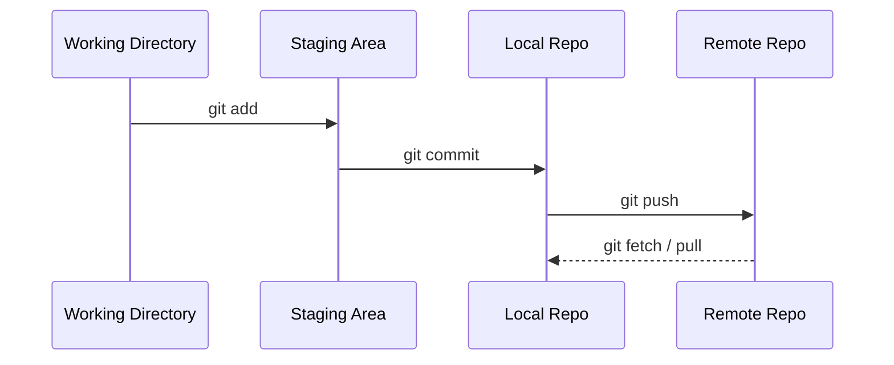
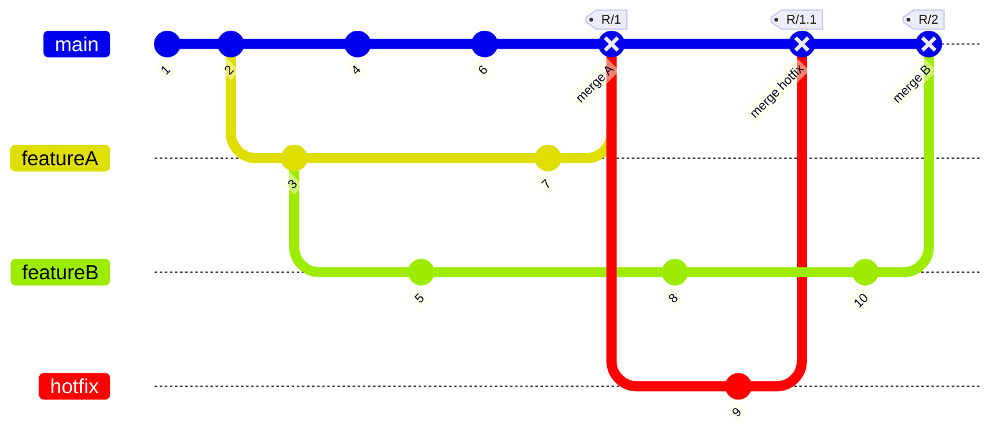

# Git Beyond the Basics <mdi-Git />

<div>
  Learn about Git, commands, and techniques to manage your workflows. This workshop will cover the basics of Git, mid to advanced concepts with best practices. How to work with mono & muti repo projects.
</div>

<div class="abs-br m-6 flex gap-2">
  Majed Al-Chatti
</div>

<!--
The last comment block of each slide will be treated as slide notes. It will be visible and editable in Presenter Mode along with the slide. [Read more in the docs](https://sli.dev/guide/syntax.html#notes)
-->

---
hideInToc: true
---

# About Me

Slidev is a slides maker and presenter designed for developers, consist of the following features

- 📝 **Text-based** - focus on the content with Markdown, and then style them later
- 🎨 **Themable** - theme can be shared and used with npm packages
- 🧑‍💻 **Developer Friendly** - code highlighting, live coding with autocompletion
- 🤹 **Interactive** - embedding Vue components to enhance your expressions
- 🎥 **Recording** - built-in recording and camera view
- 📤 **Portable** - export into PDF, PNGs, or even a hostable SPA
- 🛠 **Hackable** - anything possible on a webpage

<br>
<br>

Read more about [Why Slidev?](https://sli.dev/guide/why)

<!--
You can have `style` tag in markdown to override the style for the current page.
Learn more: https://sli.dev/guide/syntax#embedded-styles
-->

<style>
h1 {
  background-color: #2B90B6;
  background-image: linear-gradient(45deg, #4EC5D4 10%, #146b8c 20%);
  background-size: 100%;
  -webkit-background-clip: text;
  -moz-background-clip: text;
  -webkit-text-fill-color: transparent;
  -moz-text-fill-color: transparent;
}
</style>

<!--
Here is another comment.
-->

---
hideInToc: true
---
# Table of Contents

<Toc columns="3" />

<style>
h1 {
  background-color: #2B90B6;
  background-image: linear-gradient(45deg, #4EC5D4 10%, #146b8c 20%);
  background-size: 100%;
  -webkit-background-clip: text;
  -moz-background-clip: text;
  -webkit-text-fill-color: transparent;
  -moz-text-fill-color: transparent;
}
</style>


---

# Git Workflow



---

# Git Branching



---

# git init

Create an empty Git repository or reinitialize an existing one

```sh
# inside a directory
git init
# create a new directory and initialize it
git init $directory
# Initialize with a default branch name
git inti -b $branchName
```

<br/>
<br/>

> .git directory with subdirectories for __objects__, __refs/heads__, __refs/tags__, and template files.

---

# git status

Show the working tree status

```sh
git status
# Short
git status -s
# Short with Branch
git status -sb
```

<br/>

### Output

```sh
On branch master

No commits yet

Untracked files:
  (use "git add <file>..." to include in what will be committed)
        index.md

nothing added to commit but untracked files present (use "git add" to track)
```

---

# git add

Add file contents to the index

```sh
git add $file
# Add all files
git add .
# Add all files with a specific extension
git add *.md
```

<br/>

### Parital Staging

```sh
git add -p $file
```

- `y` - stage this hunk
- `n` - do not stage this hunk
- `q` - quit; do not stage this hunk or any of the remaining ones
- `e` - manually edit the current hunk

---

# git commit

Record changes to the repository

```sh
git commit -m "Commit message"
# Add all files and commit
git commit -am "Commit message"
```

<br/>

#### Rewrite History 🙃

```sh
# Change the last commit message
git commit --amend -m "New commit message"
# Undo the last commit
git reset --soft HEAD~1
# Add more files to the last commit without changin the message
git commit --amend --no-edit
# Rest author of the last commit
git commit --amend --reset-author
# Change the author of the last commit
git commit --amend --author="Majed Al-Chatti <malchatti@aus.edu>" --no-edit
```

<br/>

> Check out [git revert](https://git-scm.com/docs/git-revert) for undoing changes without rewriting history

---

# git branch

List, create, or delete branches

```sh
# Create a new branch
git branch -b $branchName
# Or Switch and create a new branch
git switch -c $branchName
git checkout -b $branchName
# Delete a branch
git branch -d $branchName
# Delete a branch without merging
git branch -D $branchName
# List all branches
git branch -a
# List all remote branches
git branch -r
# List all branches with last commit
git branch -av
```

<br/>

> git switch -c -t $remoteBranchName


---

# git cherry-pick

Apply the changes introduced by some existing commits

```sh
git cherry-pick $commitHash
```

---

# git tag

Create, list, delete or verify a tag object signed with GPG

```sh
# Create a new tag
git tag $tagName
# Create a new tag with a message
git tag -a $tagName -m "Tag message"
# Create a new tag from a commit
git tag -a $tagName $commitHash -m "Tag message"
```

<br/>

```sh
# List all tags
git tag
# List all tags with a specific pattern
git tag -l "v1.*"
```

---

# git checkout

Switch branches or restore working tree files

```sh
# Checkout a file from a commit
git checkout $commitHash $file
# Checkout a file from a branch
git checkout $branchName $file
# Checkout a commit
git checkout $commitHash
# checkout a tag
git checkout $tagName
```

<br/>

> check [git checkout](https://git-scm.com/docs/git-checkout) for more options

---

# git merge

Join two or more development histories together

```sh
# Merge a branch into the current branch
git merge $branchName
# Merge a branch into the current branch and squash all commits
git merge --squash $branchName
```

<br/>

#### Conflict Resolution

```sh
# Favour current branch
git merge -our $other_branch
# Favour Other Branch branch
git merge -Xtheirs $other_branch
# Checkout files in conflict
git checkout --[thiers|ours] .
git checkout --[thiers|ours] $pathfilename
# During merge
git rebase [--continue|--skip|--abort]
```

---

# git rebase

Reapply commits on top of another base tip

```sh
# Rebase the current branch on top of the master branch
git rebase master
# Rebase the current branch on top of the master branch and interactively
git rebase -i master
# During rebase
git rebase [--continue|--skip|--abort]
```

<br/>

#### Conflict Resolution

```sh
# Favour current branch
git rebase -Xtheirs $other_branch
# favour other branch
git rebase -Xours $other_branch
# Checkout files in conflict
git checkout --[thiers|ours] .
git checkout --[thiers|ours] $pathfilename
```

---

# git remote

```sh
# Show remote URLs
git remote -v
# Add a new remote
git remote add $remoteName $remoteUrl
# Remove a remote
git remote remove $remoteName
# Rename a remote
git remote rename $oldName $newName
# set a remote URL
git remote set-url $remoteName $remoteUrl
```

<br/>

> *origin* is the default remote name <br/>
> *upstream* is the default remote name for forked repositories


---

# git reset

Reset current HEAD to the specified state

```sh
# Reset the last commit
git reset --soft HEAD~1
# Reset the last commit and keep the changes
git reset --mixed HEAD~1
# Reset the last commit and discard the changes
git reset --hard HEAD~1
# Reset to remote branch
git reset --hard $remote/$branch
```

<br/>

#### [Rules of thumb](https://stackoverflow.com/questions/2221658/whats-the-difference-between-head-and-head-in-git)

<br/>

> Use `~` most of the time — to go back a number of generations, usually what you want<br/>
> Use `^` on merge commits — because they have two or more (immediate) parents

<br/>

> Tilde `~` is almost linear in appearance and wants to go backward in a straight line<br/>
> Caret `^` suggests an interesting segment of a tree or a fork in the road

---

# git stash

Stash the changes in a dirty working directory away

```sh
# Stash all changes
git stash
# pop the last stash
git stash pop
# list all stashes
git stash list
# Delete stash
git stash drop stash@{$n}
# Stash with message
git stash save "message"
```

---

# Azure Pull Requests with Rebase 1/2

### Merge (no fast-forward)

Running `git merge`, default strategy. All the individual commits in the pull request branch are preserved as-is, and a new merge commit is created to unite them.


### Rebase

Take each individual commit and cherry-pick them onto the master branch. Running `git rebase master` on current branch and followed by `git merge pr --ff-only` on the master branch.


---

# Azure Pull Requests with Rebase 2/2

### Squash commit

Squashing will take the tree that’s produced in a merge and creates a single new commit with those repository contents. It emulates running `git merge --squash` from the master branch.


### Semi-linear Merge

A mix of rebase and a merge, running `git rebase master` on the pull request branch, followed by `git merge pr --no-ff` on the master branch.


---
layout: image-left
image: ./images/yancy-min-842ofHC6MaI-unsplash.jpg
---

# Resources & References

<br/>

- [Git](https://git-scm.com/docs)
- [Pull Requests with Rebase, Edward Thomson](https://devblogs.microsoft.com/devops/pull-requests-with-rebase/)
- [Slidev](https://sli.dev)
- [@slidev/theme-default](https://github.com/slidevjs/themes/tree/main/packages/theme-default)


<style>
h1{
  font-size: 2rem;
}
</style>
